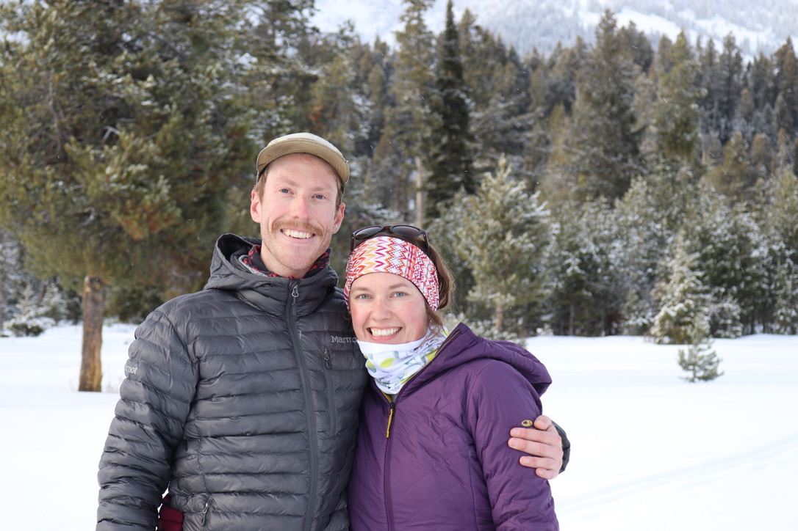
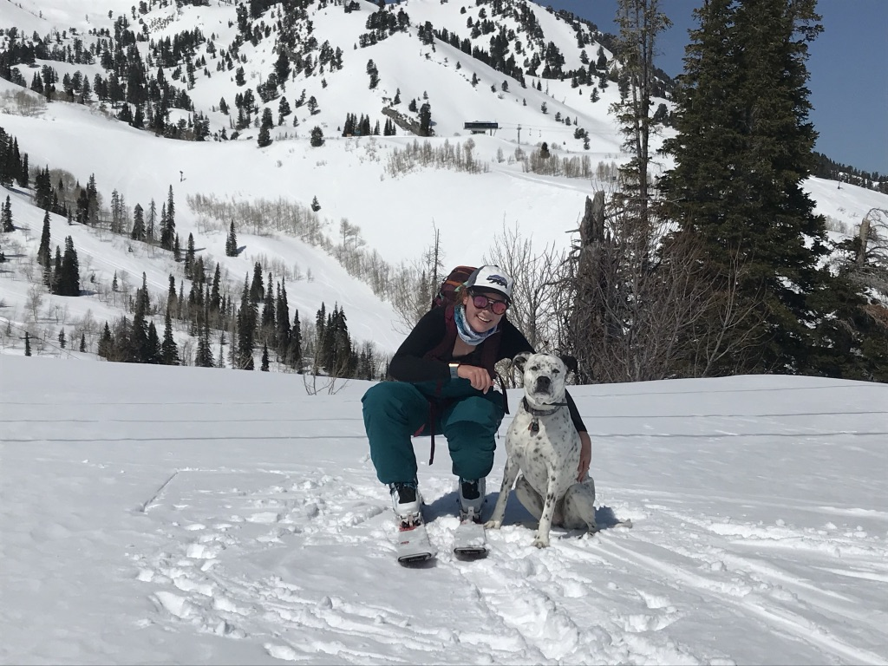

# At a Glance

After graduating with a Bachelor's Degree in Mechanical Engineering, I spent over seven years as a manufacturing enginner in both the aerospace and medical device fields before pivoting back to school for a Master's Degree in Statistics. This page will be be filled with my credentials, examples of my work, and other information. 

# Education
**Master's Degree in Statistics** 

_The University of Utah_, GPA: 4.0 - Graduated Dec 2021

**Bachelor's Degree in Mechanical Engineering** 

_The University of Vermont_, - Graduated May 2014 

# Skills 
## Languages/Software 
R, SAS, SPSS, Python, Matlab, MiniTab, Tableau, SAP, PLM, and TrackWise, and Microsoft Office 
## Course Work 
Linear and Multilinear Models, Optimization, Stochastic Processes, Probability, Statistical Inference, and Time Series Analysis

# Experience 
## Master's Final Project

_The University of Utah and Huntsman Cancer Institute_, June 2021 - Dec 2021  
* I collaborated with a biostatistician group at Huntsman Cancer Institute, who use publicly available RNA sequencing datasets for tumor tissue, to perform principal component analysis as a way to reduce the dimensionality of the data. My project centered around kidney tumor data, and all analyses were performed in R.   
* I then performed survival analysis to associate calculated PCs with different survival outcomes in the tumor data and identify High and Low risk groups. 
* After the risk groups were identified, I executed outcome modeling using PCs as predictors along with a bootstrap model validation specifically to address the problem of model overfitting. Concordance indecies, out of bounds sample error, and optimism calcuations were performed to correct for the known model overfit problem. 

## Staff Manufacturing Engineer

 _Stryker_, Oct 2015 - Aug 2020 
### Manufacturing Transfer Project
* I was the responsible Manufacturing Engineer for the product transfer of Trevo Corewire and catheter manufacturing production lines part of the Neurovascular Product Portfolio from the Mountain View, CA facility to the Salt Lake City, UT facility.
* I performed process validations on key production processes including: weaving, soldering and hydrophilic coating to ensure transferred processes met the rigid quality standards.
* I wrote and validated SLC site specific production work instructions and lot history records for compliance and regulatory requirements.
* I collaborated with a cross-functional team including: Quality Engineering, Supplier Quality Engineering, Regulatory Affairs, R&D Engineering, Sourcing and Project Management to ensure an on-time completion of the project to meet budgetary and site goals.

### Hydrophilic Coating Update Project
* I led the project to implement an automated dipping system used to dip corewires and catheters into hydrophilic coating solutions, removing the human element in the process.
* I performed a complete revalidation of the process,per Stryker statistical validation procedures,and analyzed the results using MiniTab to ensure quality standards had been maintained.
* This project avoided $1.1 Million in scrap per year, the highest value project site wide in 2019.

# Project Examples 
Follow the link below to see some of the projects I've worked on throughout my master's course work 
[Link to Project Page](./another-page.html). 

# About Me 
I learned to ski when I was 2.5 years old, and it's been a hobby ever since. My partner and I love traveling to new ski spots, always looking for the next mountain. In the summertime, I enjoy mountain biking and backpacking. When I'm at home, I am always on the hunt for a new recipe or true crime documentary. And through everything, our dog Sadie is always there to join in on the fun.

